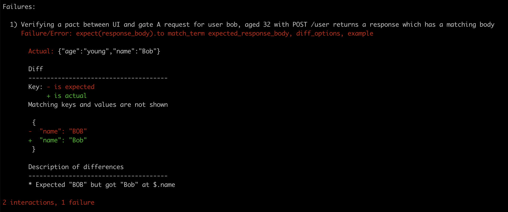

# Setup and run the Gate and the WD

## Gate (http://127.0.0.1:5000/user)
```
$ cd Gate
$ pip3 install -r requirements.txt
$ python3 src/gate.py
 * Serving Flask app "gate" (lazy loading)
 * Environment: production
   WARNING: This is a development server. Do not use it in a production deployment.
   Use a production WSGI server instead.
 * Debug mode: off
 * Running on http://127.0.0.1:5000/ (Press CTRL+C to quit)
```

## WD (http://127.0.0.1:8080/user)

```
$ cd WD
$ sbt compile run
  [info] welcome to sbt 1.4.6 (Oracle Corporation Java 14.0.2)
  [info] loading global plugins from /Users/glethuillier/.sbt/1.0/plugins
  [info] loading settings for project wd-build from plugins.sbt ...
  [info] loading project definition from /Users/glethuillier/contract-test-poc/wd/project
  [info] loading settings for project root from build.sbt,pact.sbt ...
  [info] set current project to wd (in build file:/Users/glethuillier/contract-test-poc/wd/)
  [info] running com.ledger.QuickstartApp
  SLF4J: Class path contains multiple SLF4J bindings.
  SLF4J: Found binding in [jar:file:/Users/glethuillier/contract-test-poc/wd/target/bg-jobs/sbt_8982dab0/target/a31b0356/97705cb7/logback-classic-1.2.3.jar!/org/slf4j/impl/StaticLoggerBinder.class]
  SLF4J: Found binding in [jar:file:/Users/glethuillier/contract-test-poc/wd/target/bg-jobs/sbt_8982dab0/target/fe4bdae1/9e6c1f2b/slf4j-simple-1.6.4.jar!/org/slf4j/impl/StaticLoggerBinder.class]
  SLF4J: See http://www.slf4j.org/codes.html#multiple_bindings for an explanation.
  SLF4J: Actual binding is of type [ch.qos.logback.classic.util.ContextSelectorStaticBinder]
  SLF4J: A number (1) of logging calls during the initialization phase have been intercepted and are
  SLF4J: now being replayed. These are subject to the filtering rules of the underlying logging system.
  SLF4J: See also http://www.slf4j.org/codes.html#replay
  [2021-02-23 13:33:36,352] [INFO] [akka.event.slf4j.Slf4jLogger] [HelloAkkaHttpServer-akka.actor.default-dispatcher-3] [] - Slf4jLogger started
  [2021-02-23 13:33:38,096] [INFO] [akka.actor.typed.ActorSystem] [HelloAkkaHttpServer-akka.actor.default-dispatcher-5] [] - Server online at http://127.0.0.1:8080/
```

## Perform some requests to the gate

```
$ curl -s -H "Content-type: application/json" -X POST -d '{"name": "Alice", "age": 42}' http://localhost:5000/user | jq
{
  "age": "young",
  "name": "ALICE"
}
$ curl -s -H "Content-type: application/json" -X POST -d '{"name": "Bob", "age": 101}' http://localhost:5000/user | jq
{
  "age": "old",
  "name": "BOB"
}
```
# Install pact stand alone locally

## For MAC OS
```
$ brew tap pact-foundation/pact-ruby-standalone
$ brew install pact-ruby-standalone
```

# Generate the original pacts and verify both providers

## 0. Run the broker

```
$ cd broker
$ docker-compose up
```

Connect to http://localhost/

(credentials: `README.md` from broker subdirectory)


## 1. Generate pact via UI tests (UI expectations)


_(Ensure that the Gate and WD servers are down)._

- UI consumer version: `0.0.1c`
- Gate provider version: **not relevant at this stage**

```
$ cd UI
$ npm install (only for the first time)
$ npm test
```


http://localhost/matrix/provider/gate/consumer/UI


## 2. Verify Gate provider against UI expectations


- UI consumer version: `0.0.1c`
- Gate provider version: `0.0.2p` **(important)**

a) Run both Gate and WD servers

b) Run the verification from anywhere using `pact-provider-verifier`
```
$ pact-provider-verifier --provider-base-url=http://localhost:5000 --pact-broker-base-url=http://localhost --broker-username=pactbroker --broker-password=PoC_P4CT! --provider="Gate" --consumer-version-tag="expectations_from_UI_0.0.1c" --publish-verification-results --provider-app-version="0.0.2p"
```

c) The Gate provider is now versionned and the pact, in this context, verified

http://localhost/matrix/provider/Gate/consumer/UI


## 3. Generate pact via Gate tests (Gate consumer expectations)


- Gate consumer version: `0.0.2p`
- WD provider version:  **not relevant at this stage**

_(Ensure that the Gate and WD servers are down)._

```
$ cd Gate/tests
$ python -m pytest pact_wd.py
```

New contract:


http://localhost/matrix/provider/wd/consumer/gate


## 4. Verify WD provider against Gate consumer expectations


- Gate consumer version: `0.0.2c`
- WD provider version: `0.0.3p` **(important)**

a) Run both Gate and WD servers

b) Run the verification from anywhere using `pact-provider-verifier`
```
$ pact-provider-verifier --provider-base-url=http://localhost:8080 --pact-broker-base-url=http://localhost --broker-username=pactbroker --broker-password=PoC_P4CT! --provider="WD" --consumer-version-tag="expectations_from_gate_0.0.2c" --publish-verification-results --provider-app-version="0.0.3p"
```

c) The WD provider is now versionned and the pact, in this context, verified

http://localhost/matrix/provider/WD/consumer/Gate


# Change the Gate provider implementation

**Change: the name is no longer capitalized**

a) Modify the way the Gate responds to a request in such a way that it produces a breach of contract. For instance:

```
diff --git a/Gate/src/gate.py b/Gate/src/gate.py
index c383584..3d6afe7 100644
--- a/Gate/src/gate.py
+++ b/Gate/src/gate.py
@@ -10,7 +10,7 @@ def request_wd(name, age):
     return req.content.decode('utf-8')

 def capitalize_name(name):
-    return name.upper()
+    return name
```

b) Re-run Gate and WD servers

c) Verify

```
$ pact-provider-verifier --provider-base-url=http://localhost:5000 --pact-broker-base-url=http://localhost --broker-username=pactbroker --broker-password=PoC_P4CT! --provider="Gate" --consumer-version-tag="expectations_from_UI_0.0.1c" --publish-verification-results --provider-app-version="0.0.2p"
```



d) From the broker interface:


# Change the WD provider implementation

**Change: old when >= 200 years old instead of 100**

a) Modify the way the WD responds to a request in such a way that it produces a breach of contract. For instance:

```
diff --git a/wd/src/main/scala/com/Ledger/UserRegistry.scala b/wd/src/main/scala/com/Ledger/UserRegistry.scala
index 6f506de..788077b 100644
--- a/wd/src/main/scala/com/Ledger/UserRegistry.scala
+++ b/wd/src/main/scala/com/Ledger/UserRegistry.scala
@@ -1,9 +1,7 @@
 package com.ledger

-import akka.actor.typed.ActorRef
-import akka.actor.typed.Behavior
+import akka.actor.typed.{ActorRef, Behavior}
 import akka.actor.typed.scaladsl.Behaviors
-import scala.collection.immutable

 final case class User(name: String, age: Int)

@@ -20,7 +18,7 @@ object UserRegistry {
       case JudgeAge(user, replyTo) =>
         var age = user.age
         var judgement = "young"
-        if (age >= 100) {
+        if (age >= 200) {
           judgement = "old"
         }
         replyTo ! JudgmentPerformed(s"${user.name}", judgement)
```

b) Re-run Gate and WD servers

c) Verify

```
$ pact-provider-verifier --provider-base-url=http://localhost:8080 --pact-broker-base-url=http://localhost --broker-username=pactbroker --broker-password=PoC_P4CT! --provider="WD" --consumer-version-tag="expectations_from_gate_0.0.2c" --publish-verification-results --provider-app-version="0.0.3p"
```


d) From the broker interface:


